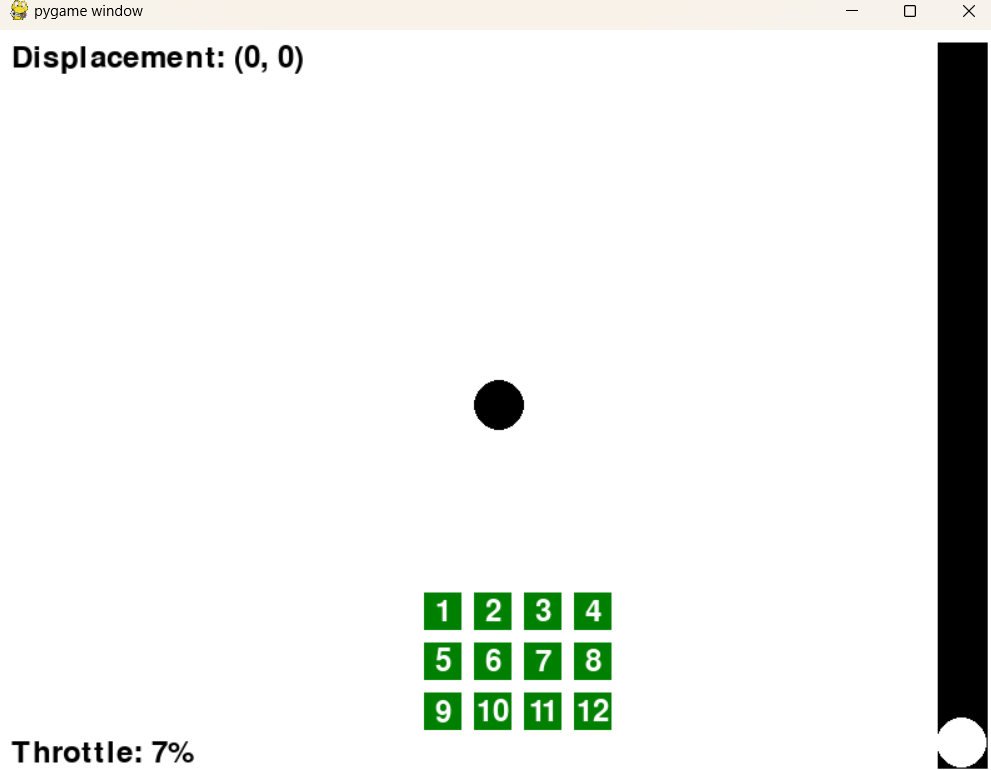
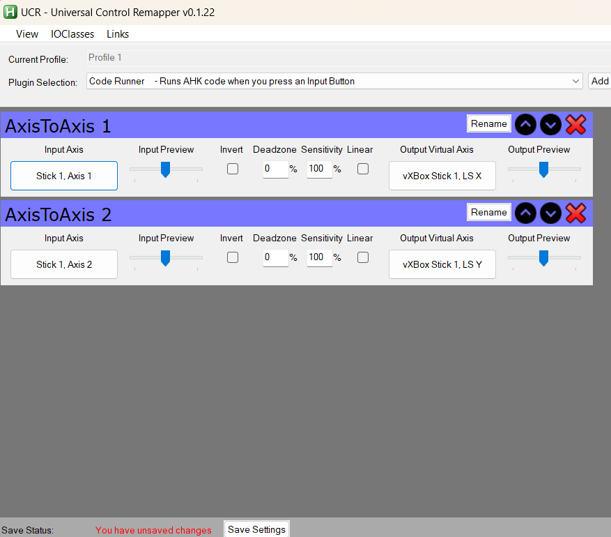

# Virtual Analog Joystick
 Install vJoy and run vJoyConfig.exe to configure vJoy device.\ 

 Run virtual analog joystick.py to start the program.\

 Install universal controller remapper from https://github.com/evilC/UCR/releases and run UCR.exe\

 Click and drag the center circle to move the joystick.\

 

 